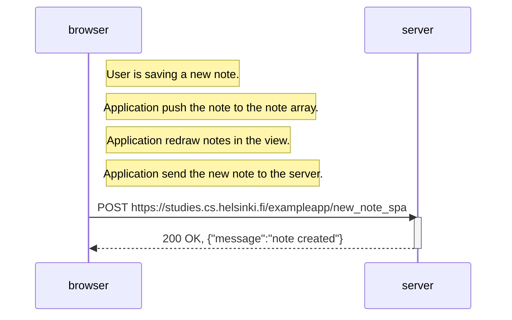

```mermaid
sequenceDiagram
    participant browser
    participant server

    Note right of browser: User is saving a new note.
    Note right of browser: Application push the note to the note array.
    Note right of browser: Application redraw notes in the view.
    Note right of browser: Application send the new note to the server.

    browser->>server: POST https://studies.cs.helsinki.fi/exampleapp/new_note_spa
    activate server
    server-->>browser: 200 OK, {"message":"note created"}
    deactivate server

```
